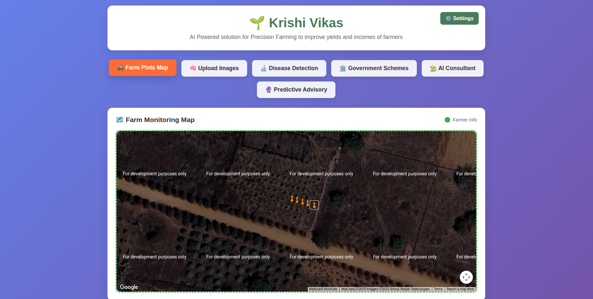

# 🌱 Krishi Vikas - AI Powered Farming Assistant

**Krishi Vikas** is an AI-powered, open-source solution designed to empower farmers with precision farming techniques, helping to improve crop yields and income. This comprehensive farming assistant provides intelligent insights, disease detection, government scheme information, and predictive analytics to support modern agriculture.



## 🎯 Mission

To democratize access to AI-powered farming technology, making precision agriculture affordable and accessible to farmers worldwide, ultimately contributing to food security and sustainable farming practices.

## ✨ Features

### 🔬 AI-Powered Disease Detection
- Upload crop images for instant AI analysis
- Identify diseases, pests, and nutrient deficiencies
- Get treatment recommendations and prevention tips
- Support for 50+ common crop diseases

### 🏛️ Government Schemes & Subsidies
- Real-time updates on latest agricultural schemes
- Eligibility checker for various subsidies
- Application guidance and documentation help
- State-wise scheme information

### 👨‍🌾 AI Farming Consultant
- Interactive chat with agricultural AI expert
- Personalized farming advice based on your location and crops
- Weather-based recommendations
- Crop calendar and planning assistance

### 📮 Predictive Advisory System
- Weather-based crop advisories
- Pest and disease outbreak predictions
- Optimal planting and harvesting time suggestions
- Market price predictions and trends

### 🗺️ Farm Management Tools
- Interactive farm plot mapping
- Crop rotation planning
- Resource allocation optimization
- Yield tracking and analytics

### 🧠 Custom AI Training
- Integrated Teachable Machine for custom model training
- Train models specific to your crops and conditions
- Community model sharing platform

## 🚀 Quick Start

### Prerequisites

Before you begin, ensure you have the following installed:

- **Node.js** (version 14.0.0 or higher) - [Download here](https://nodejs.org/)
- **npm** (comes with Node.js) or **yarn**
- **Git** - [Download here](https://git-scm.com/)

### Installation

1. **Clone the repository**
   ```bash
   git clone https://github.com/alumnx-ai-labs/agro-bot-frontend.git
   cd agro-bot-frontend
   ```

2. **Install dependencies**
   ```bash
   npm install
   # or
   yarn install
   ```

3. **Set up environment variables**
   ```bash
   cp .env.example .env.local
   ```
   Edit `.env.local` with your configuration:
   ```env
   REACT_APP_API_BASE_URL=your_api_base_url
   REACT_APP_WEATHER_API_KEY=your_weather_api_key
   REACT_APP_MAPS_API_KEY=your_maps_api_key
   ```

4. **Start the development server**
   ```bash
   npm run dev
   # or
   yarn run dev
   ```

5. **Open your browser**
   Navigate to `http://localhost:3000` to see the application running.

## 🏗️ Project Structure

```
agro-bot-frontend/
├── public/                 # Static files
├── src/
│   ├── components/        # Reusable UI components
│   │   ├── common/       # Generic components
│   │   ├── disease/      # Disease detection components
│   │   ├── consultant/   # AI consultant components
│   │   └── maps/         # Map-related components
│   ├── pages/            # Page components
│   ├── services/         # API services
│   ├── hooks/            # Custom React hooks
│   ├── utils/            # Utility functions
│   ├── contexts/         # React contexts
│   ├── assets/           # Images, icons, etc.
│   └── styles/           # CSS and styling files
├── docs/                 # Documentation
├── tests/                # Test files
└── package.json
```

## 🔧 Configuration

### API Configuration
The app requires several API integrations. Update your `.env.local` file:

```env
# Backend API
REACT_APP_API_BASE_URL=https://your-backend-api.com

# Weather Service
REACT_APP_WEATHER_API_KEY=your_openweather_api_key

# Maps Integration
REACT_APP_MAPS_API_KEY=your_google_maps_api_key

# AI Services
REACT_APP_AI_MODEL_ENDPOINT=your_ai_model_endpoint
```

### Supported Browsers
- Chrome (recommended)
- Firefox
- Safari
- Edge

## 📱 Mobile Support

Krishi Vikas is fully responsive and optimized for mobile devices. The PWA (Progressive Web App) version allows offline functionality for critical features.

## 🚀 Deployment

### Production Build
```bash
npm run build
```

### Deploy to Popular Platforms

**Netlify:**
1. Connect your GitHub repository
2. Set build command: `npm run build`
3. Set publish directory: `build`

**Vercel:**
1. Import project from GitHub
2. Framework preset: Create React App
3. Deploy

**Heroku:**
```bash
# Create Heroku app
heroku create your-app-name

# Deploy
git push heroku main
```

## 📊 Performance

- Lighthouse Score: 95+ (Performance, Accessibility, Best Practices, SEO)
- Bundle size optimized with code splitting
- Image optimization and lazy loading
- Service worker for offline functionality

## 🔒 Security

- All API endpoints use HTTPS
- Input sanitization and validation
- CORS properly configured
- No sensitive data in client-side code

## 🌍 Internationalization

Currently supports:
- English (default)
- Hindi
- Regional Indian languages (planned)

## 📈 Analytics & Monitoring

- Google Analytics integration
- Error tracking with Sentry
- Performance monitoring
- User feedback collection

## 🤝 Contributing

We welcome contributions from developers of all skill levels! Please read our [Contributing Guidelines](./CONTRIBUTING.md) for detailed information on how to contribute to this project.

### Quick Contribution Steps:
1. Fork the repository
2. Create a feature branch targeting `dev`
3. Make your changes
4. Submit a pull request to the `dev` branch

See [CONTRIBUTING.md](./CONTRIBUTING.md) for detailed instructions.

## 📝 License

This project is licensed under the MIT License - see the [LICENSE.md](LICENSE.md) file for details.

## 🙏 Acknowledgments

- Thanks to all contributors who have helped build this project
- Agricultural experts who provided domain knowledge
- Open source community for amazing tools and libraries
- Farmers who provided feedback and real-world testing

## 📞 Support & Community

- **Issues**: [GitHub Issues](https://github.com/alumnx-ai-labs/agro-bot-frontend/issues)
<!-- - **Discussions**: [GitHub Discussions](https://github.com/alumnx-ai-labs/agro-bot-frontend/discussions) -->
- **Email**: support@alumnx.com
<!-- - **Documentation**: [Wiki](https://github.com/alumnx-ai-labs/agro-bot-frontend/wiki) -->

## 🗺️ Roadmap

### Current Version (v1.0)
- ✅ Disease detection
- ✅ AI consultant
- ✅ Government schemes
- ✅ Basic farm mapping

### Upcoming Features (v2.0)
- 🔄 IoT sensor integration
- 🔄 Advanced analytics dashboard
- 🔄 Multi-language support
- 🔄 Mobile app (React Native)

### Future Vision (v3.0)
- 📋 Drone integration
- 📋 Blockchain-based supply chain
- 📋 AI-powered market predictions
- 📋 Community marketplace

## 📊 Project Stats


---

**Made with ❤️ for farmers worldwide** 🌾